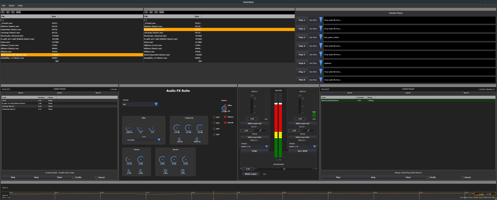

# RadioBlast

A professional desktop DJ application featuring dual-deck mixing, advanced audio effects, and playlist management for seamless live performances.

## Features

### Core DJ Features

- **Dual Deck System**: Independent left and right deck controls with crossfader
- **Professional Mixer**: Crossfader with precise volume and channel controls
- **Playlist Management**: Organize tracks with BPM and duration display
- **Sample Player**: 8-slot sample player with instant trigger capabilities
- **Beat Sync**: Automatic BPM detection and synchronization between decks
- **Cue System**: Preview tracks and set cue points

### Advanced Audio Processing

- **Filter Section**: High-pass, band-pass, and low-pass filters with resoance control
- **3-Band EQ**: Dedicated EQ controls for each deck (High, Mid, Low)
- **Audio Effects Suite**: 
&nbsp; - Chorus, Phaser, Delay

&nbsp; - Pitch control and time stretching

&nbsp; - Reverb and modulation effects

- **Real-time Waveform Display**: Visual feedback with detailed track analysis
- **VU Meters**: Professional-grade level monitoring for both channels

### Library & Organization

- **Smart Music Library**: Browse and organize your music collection
- **BPM Detection**: Automatic tempo analysis for all tracks
- **File Format Support**: MP3, WAV, FLAC, and other common audio formats

## System Requirements

### Minimum Requirements
-
- **OS**: Windows 10/11
- **RAM**: 4 GB RAM
- **Storage**: 100 MB available space
- **Audio**: Built-in audio interface or dedicated sound card

### Recommended

- **RAM**: 8 GB or more
- **Audio Interface**: Professional DJ audio interface (e.g., Pioneer, Native Instruments)
- **Controllers**: MIDI DJ controllers for enhanced control

## Installation

### Windows ###

Download the latest release from th Releases section and run it

## Quick Start Guide

### Loading Your First Track

1. Click on the **Playlist** section (top area)
2. Use **File → Import** to add music to your library
3. Drag a track from the playlist to **Deck A** or **Deck B**
4. Press the **Play** button to start playback

### Basic Mixing

1. Load different tracks on Deck A and Deck B
2. Use the **crossfader** (center bottom) to blend between decks
3. Adjust **volume faders** for each deck independently
4. Use **EQ controls** (High/Mid/Low) to shape the sound
5. Apply **filters** for creative transitions

### Using Effects

1. Select an effect from the **Audio FX Suite** center panel
1. Adjust effect parameters using the blue knobs
3. Use the **Filter** section for real-time frequency manipulation
4. Combine multiple effects for complex sound design

### Sample Player

- Load samples into the 8 sample slots (top right)
- Click **Play** buttons for instant sample triggering
- Perfect for drops, air horns, and vocal samples

## Audio Setup

### Configuring Audio Output

1. Go to **File → Audio Settings**
2. Select your audio interface from the dropdown
3. Configure sample rate (recommended: 44.1 kHz or 48 kHz)
4. Set buffer size for optimal latency (128-512 samples)

### Professional Setup

- **Main Output**: Connect to your main speakers/PA system
- **Headphone Output**: Use dedicated headphone output for cueing
- **Split Cue**: Enable split cueing to preview tracks in one ear

## MIDI Controller Integration

Audio FX Suite supports popular MIDI controllers:

- Pioneer DDJ series
- Native Instruments Traktor controllers
- Numark and Hercules controllers
- Generic MIDI mapping available

### Setting up MIDI

1. Connect your controller via USB
2. Go to **File → MIDI Settings**
3. Select your controller or choose "Generic MIDI"
4. Use MIDI learn function to map custom controls

## File Formats Supported

### Audio Input
- **Lossless**: WAV, FLAC, AIFF
- **Compressed**: MP3, AAC, OGG Vorbis
- **Professional**: BWF, RF64

### Export/Recording

- **High Quality**: WAV (16/24-bit)
- **Compressed**: MP3 (320 kbps)
- **Streaming**: OGG Vorbis

## Troubleshooting

### Audio Issues

**No sound output:**

- Check audio device selection in Audio Settings
- Verify volume levels on mixer and system
- Test with different audio interface

**Audio dropouts/crackling:**

- Increase buffer size in Audio Settings
- Close unnecessary applications
- Check CPU usage in Task Manager

### Performance

**High CPU usage:**

- Reduce visual effects quality
- Close other audio applications
- Consider upgrading RAM or CPU

### MIDI Controller Issues

**Controller not recognized:**

- Install manufacturer drivers
- Check USB connection
- Restart application after connecting

## Development

This is a desktop application built with modern audio processing technology. For development inquiries or contributions, please see our [Contributing Guidelines](CONTRIBUTING.md).

### Technology Stack

- Cross-platform desktop application
- Real-time audio processing engine
- Professional-grade mixing algorithms
- Hardware acceleration support

## Support & Community

- **Manual**: Complete user guide available in Help menu
- **Issues**: [GitHub Issues](https://github.com/mpue/RadioBlast/issues)

## License

None yet

## Changelog

0.0.1 first Alpha preview (unstable)

###

---

